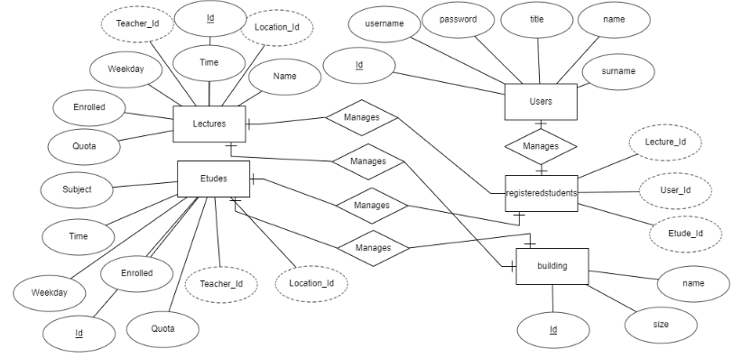

Parts Implemented by Muhammed Furkan Kamer
==========================================

Database Design
---------------

I implemented three tables and two extra tables in this project: *Users*, *Lectures* and *Etudes* and *registeredstudents*,*building*.

In my tables;

    E/R diagram for managers, teachers and students.

Code
----

The implementation of tables in the database is done using the following code block:

.. code-block:: python
    :name: dbinit.py

    INIT_STATEMENTS = [
        """CREATE TABLE if not exists Users ( id SERIAL PRIMARY KEY,
    username VARCHAR(255) NOT NULL UNIQUE,
    password VARCHAR(255) NOT NULL,
    title VARCHAR(255) NOT NULL,
    name VARCHAR(255) NOT NULL,
    surname VARCHAR(255) NOT NULL );""",

    """CREATE TABLE if not exists Buildings ( id SERIAL PRIMARY KEY, 
    name varchar(255) NOT NULL, 
    size int);""",

    """CREATE TABLE if not exists Lectures ( id SERIAL PRIMARY KEY,
    name VARCHAR(255),
    time TIME,
    weekday VARCHAR(255),
    enrolled int DEFAULT 0,
    location_id int,
    FOREIGN KEY (location_id)REFERENCES Buildings(id),
    teacher_id int,
    FOREIGN KEY (teacher_id) REFERENCES Teachers (id),
    quota int,CONSTRAINT time_cons UNIQUE(time,weekday,location_id),
    CONSTRAINT teacher_cons UNIQUE(time,weekday,teacher_id));""",

    """CREATE TABLE if not exists Etudes ( id SERIAL PRIMARY KEY,
    subject VARCHAR(255),
    teacher_id int, 
    FOREIGN KEY (teacher_id) REFERENCES Teachers(id),
    time TIME,
    weekday VARCHAR(255),
    enrolled int DEFAULT 0,
    location_id int NOT NULL, 
    FOREIGN KEY (location_id) REFERENCES Buildings(id),
    quota int);""",

    """CREATE TABLE if not exists RegisteredStudents (
    lecture_id int, 
    FOREIGN KEY (lecture_id) REFERENCES Lectures(id),
    student_id int , 
    FOREIGN KEY (student_id) REFERENCES Users(id),
    etude_id int , 
    FOREIGN KEY (etude_id) REFERENCES Etudes(id),
    CONSTRAINT reg_cons UNIQUE(student_id,lecture_id),
    CONSTRAINT regi_cons UNIQUE(student_id,etude_id));""",
    ]
	
Sign Up Function
^^^^^^^^^^^^^^^^^^	

Code
----
Sign-Up function implemented as a function when form is posted from html page.
It first gets posted data from the form and if it is not in error, it inserts new user
to Users table. Then it also inserts other tables (Students, Teachers, Managers) according to
given title information.
.. code-block:: python
    :name: server.py
	@app.route('/signup', methods=['POST'])
	def my_form_post():
		username = request.form['UserName']
		password = pbkdf2_sha256.hash(request.form['Password'])
		firstname = request.form['FirstName']
		lastname = request.form['LastName']
		title = request.form.getlist('title')
		title = title[0]
		userid = 0
		statement = """INSERT INTO Users (username, password, title, name, surname)
		VALUES ('%s', '%s', '%s', '%s', '%s');""" % (username, password, title, firstname, lastname)
		statement += """select id from users where username = '%s'""" % (username)
		with psycopg2.connect(url) as connection:
			with connection.cursor() as cursor:
				cursor.execute(statement)
				userid += cursor.fetchone()[0]
		statement = """"""
		if title == "Student":
			degree = request.form['Degree']
			statement += """INSERT INTO Students (name,surname,degree,grade,user_id)
			VALUES ('%s', '%s', '%s', NULL,'%s');""" % (firstname, lastname, degree, userid)
		if title == "Teacher":
			print(request.form)
			experience_year = request.form['Experience']
			subject = request.form['subject']
			statement += """INSERT INTO Teachers (name,surname,subject,experience_year,user_id)
			VALUES ('%s', '%s', '%s', '%s','%s');""" % (firstname, lastname, subject, experience_year, userid)
		if title == "Manager":
			experience_year = request.form['Experience']
			print(experience_year)
			statement += """INSERT INTO Managers (name,surname,user_id,experience_year)
			VALUES ('%s', '%s', '%s', '%s');""" % (firstname, lastname, userid, experience_year)
		with psycopg2.connect(url) as connection:
			with connection.cursor() as cursor:
				cursor.execute(statement)
				return render_template("homepage.html")

	