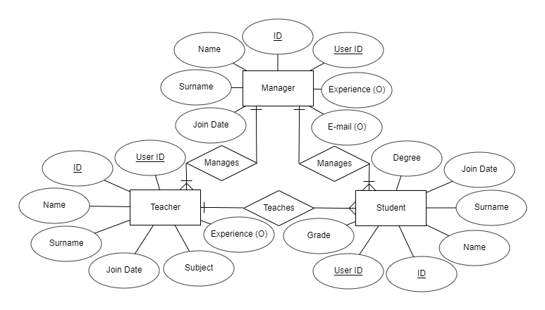

Parts Implemented by Burak Bozdağ
=================================

Database Design
---------------

I implemented three tables in this project: *Managers*, *Teachers* and *Students*.

Managers manages teachers and students. Teachers teaches students. Teachers gives lectures and etudes to students.
Students takes lectures and etudes from teachers. Managers also manages these lectures and etudes. The E/R diagram is
shown below:

    E/R diagram for managers, teachers and students.

Code
----

The implementation of tables in the database is done using the following code block:

.. code-block:: python
    :name: dbinit.py

    INIT_STATEMENTS = [
        """CREATE TABLE if not exists Managers ( id SERIAL PRIMARY KEY,
        name VARCHAR(255) NOT NULL,
        surname VARCHAR(255) NOT NULL,
        email VARCHAR(255),
        join_date DATE NOT NULL DEFAULT CURRENT_DATE,
        experience_year int,
        user_id int NOT NULL,
        FOREIGN KEY (user_id) REFERENCES Users(id));""",

        """CREATE TABLE if not exists Teachers ( id SERIAL PRIMARY KEY,
        name VARCHAR(255) NOT NULL,
        surname VARCHAR(255) NOT NULL,
        subject varchar(255),
        join_date DATE NOT NULL DEFAULT CURRENT_DATE,
        experience_year int,
        user_id int NOT NULL,
        FOREIGN KEY (user_id) REFERENCES Users(id));""",

        """CREATE TABLE if not exists Students ( id SERIAL PRIMARY KEY,
        name VARCHAR(255) NOT NULL,
        surname VARCHAR(255) NOT NULL,
        degree int NOT NULL,
        join_date DATE NOT NULL DEFAULT CURRENT_DATE,
        grade FLOAT,
        user_id int NOT NULL,
        FOREIGN KEY (user_id) REFERENCES Users(id));""",
    ]

Database Functions
^^^^^^^^^^^^^^^^^^

The most used database functions are implemented in a separate file called *database.py* to avoid redundant codes in
*server.py*.

Getting user
""""""""""""

.. code-block:: python
    :name: database.py

    def get_user(self, username):
        user = object()
        user.username = username
        with dbapi2.connect(self.dbfile) as connection:
            cursor = connection.cursor()
            query = """SELECT username, password, title, name, surname FROM Users WHERE username = %s""" % (username,)
            cursor.execute(query)
            curs = cursor.fetchall()
            user.password = curs[1]
            user.title = curs[2]
            user.name = curs[3]
            user.surname = curs[4]
        return user

Updating user
"""""""""""""

.. code-block:: python
    :name: database.py

    def update_user(self, user_id, user):
        with dbapi2.connect(self.dbfile) as connection:
            cursor = connection.cursor()
            query = """UPDATE Users
            SET " username = '%s', password = '%s' title = '%s' name = '%s' surname = '%s' WHERE (id = %s)""" % (
                user.username, user.password, user.title, user.name, user.surname, user_id)
            cursor.execute(query)
            connection.commit()

Updating Profile
""""""""""""""""

.. code-block:: python
    :name: database.py

    def update_profile(self, user_id, profile):  # Changeable attributes: name, surname (general updating)
        with dbapi2.connect(self.dbfile) as connection:
            cursor = connection.cursor()
            query = "SELECT title FROM Users WHERE id = %s" % (user_id,)
            cursor.execute(query)
            title = cursor.fetchone()[0]
            title += "s"
            query = "UPDATE %s SET name = '%s', YR = %s WHERE (ID = %s)" % (
                title, profile.name, profile.surname, profile.id)
            cursor.execute(query)
            connection.commit()

Deleting User
"""""""""""""

.. code-block:: python
    :name: database.py

    def delete_user(self, user_id, profile_id):  # Deletes user and profile
        with dbapi2.connect(self.dbfile) as connection:
            cursor = connection.cursor()
            query = "SELECT title FROM Users WHERE id = %s" % (user_id,)
            cursor.execute(query)
            title = cursor.fetchone()[0]
            title += "s"
            query = """DELETE FROM %s WHERE (id = %s)""" % (title, profile_id)
            cursor.execute(query)
            query = """DELETE FROM Users WHERE (id = %s)""" % (user_id,)
            cursor.execute(query)
            connection.commit()

There are many view functions such as login, home page, profile, etc. These functions are described in next parts.

Log In and Log Out
^^^^^^^^^^^^^^^^^^^

When logging in, the server checks whether the username exists in the database. Then, password checking is done using
hashing methods. If these requirements are satisfied, the user logs into the site successfully.

The following code block is responsible for logging in:

.. code-block:: python
    :name: server.py

    @app.route("/login", methods=['POST'])
    def login():
        username = request.form['UserName']
        user = get_user(username)
        if user is not None:
            password = request.form['Password']
            password1 = user.password
            if pbkdf2_sha256.verify(password, password1):
                login_user(user)
                flash("You have logged in.")
                return redirect("/")
        return render_template("signin.html", message="Invalid credentials.")

When logging out, the server checks whether a user is already logged in, then proceeds to the logging out process.

The following code block is responsible for logging out:

.. code-block:: python
    :name: server.py

    @login_required
    @app.route("/logout")
    def logout():
        if not current_user.is_authenticated:
            return redirect("/")
        logout_user()
        return render_template("homepage.html", message="You have logged out.")

The Profile Page
^^^^^^^^^^^^^^^^

View Profile Attributes
"""""""""""""""""""""""

If a user wants to look at his/her information that is stored in the database, the user can enter to the profile page.
The profile view function displays all attributes that a user has in the output.

The following code block is responsible for displaying profile attributes:

.. code-block:: python
    :name: server.py

    @login_required
    @app.route("/profile")
    def profile():
        if not current_user.is_authenticated:
            return redirect("/")
        titles = """select title from users where username = '%s'""" % (current_user.username,)
        with psycopg2.connect(url) as connection:
            with connection.cursor() as cursor:
                cursor.execute(titles)
                title = cursor.fetchone()[0]
                if title == "Manager":
                    statement = """SELECT * FROM Managers WHERE user_id = (SELECT id FROM Users WHERE username = '%s')""" \
                                % (current_user.username,)
                    cursor.execute(statement)
                    for row in cursor.fetchall():
                        print(row)
                        name = row[1]
                        surname = row[2]
                        email = row[3]
                        join_date = row[4]
                        experience = row[5]
                    return render_template("profile.html",
                                           username=current_user.username, title=title, name=name, surname=surname,
                                           email=email, join_date=join_date, experience=experience)
                elif title == "Teacher":
                    statement = """SELECT * FROM Teachers WHERE user_id = (SELECT id FROM Users WHERE username = '%s')""" \
                                % (current_user.username,)
                    cursor.execute(statement)
                    for row in cursor.fetchall():
                        print(row)
                        name = row[1]
                        surname = row[2]
                        subject = row[3]
                        join_date = row[4]
                        experience = row[5]
                    return render_template("profile.html",
                                           username=current_user.username, title=title, name=name, surname=surname,
                                           subject=subject, join_date=join_date, experience=experience)
                elif title == "Student":
                    statement = """SELECT * FROM Students WHERE user_id = (SELECT id FROM Users WHERE username = '%s')""" \
                                % (current_user.username,)
                    cursor.execute(statement)
                    for row in cursor.fetchall():
                        print(row)
                        name = row[1]
                        surname = row[2]
                        degree = row[3]
                        join_date = row[4]
                        grade = row[5]
                    return render_template("profile.html",
                                           username=current_user.username, title=title, name=name, surname=surname,
                                           degree=degree, join_date=join_date, grade=grade)
                else:
                    abort(404)

Update Profile Attributes
"""""""""""""""""""""""""

The user may want to update his/her attributes. For this problem, there is a function that lets the user to update
information in the database.

The following code block is responsible for updating profile:

.. code-block:: python
    :name: server.py

    @login_required
    @app.route("/update-profile")
    def profile_update():
        if not current_user.is_authenticated:
            return redirect("/")
        query = """SELECT id, title FROM Users WHERE username = '%s'""" % (current_user.username,)
        with psycopg2.connect(url) as connection:
            with connection.cursor() as cursor:
                cursor.execute(query)
                for row in cursor.fetchall():
                    print(row)
                    user_id = row[0]
                    title = row[1]
                if title == "Manager":
                    query = """SELECT name, surname, email, experience_year FROM Managers WHERE user_id = %s""" % (user_id,)
                    cursor.execute(query)
                    for row in cursor.fetchall():
                        name = row[0]
                        surname = row[1]
                        email = row[2]
                        experience = row[3]
                    return render_template("update-profile.html", name=name, surname=surname, email=email,
                                           experience=experience)
                elif title == "Teacher":
                    query = """SELECT name, surname, subject, experience_year FROM Teachers WHERE user_id = %s""" % user_id
                    cursor.execute(query)
                    for row in cursor.fetchall():
                        name = row[0]
                        surname = row[1]
                        subject = row[2]
                        experience = row[3]
                    return render_template("update-profile.html",
                                           name=name, surname=surname, subject=subject, experience=experience)
                elif title == "Student":
                    query = """SELECT name, surname, degree FROM Students WHERE user_id = %s""" % (user_id,)
                    cursor.execute(query)
                    for row in cursor.fetchall():
                        name = row[0]
                        surname = row[1]
                        degree = row[2]
                    return render_template("update-profile.html", name=name, surname=surname, degree=degree)
                else:
                    abort(404)

In order to submit changes to update the profile, there must be a route for *POST* method to update the database:

.. code-block:: python
    :name: server.py

    @login_required
    @app.route("/update-profile", methods=['POST'])
    def update_profile():
        if not current_user.is_authenticated:
            return redirect("/")
        query = """SELECT id, title FROM Users WHERE username = '%s'""" % (current_user.username,)
        with psycopg2.connect(url) as connection:
            with connection.cursor() as cursor:
                cursor.execute(query)
                for row in cursor.fetchall():
                    print(row)
                    user_id = row[0]
                    title = row[1]
                if title == "Manager":
                    name = request.form['name']
                    surname = request.form['surname']
                    email = request.form['email']
                    experience = request.form['experience']
                    query = """UPDATE Managers SET name = '%s', surname = '%s', email = '%s', experience_year = %s
                    WHERE user_id = %s""" % (name, surname, email, experience, user_id)
                    cursor.execute(query)
                    query = """UPDATE Users SET name = '%s', surname = '%s' WHERE id = %s""" % (name, surname, user_id)
                    cursor.execute(query)
                    connection.commit()
                elif title == "Teacher":
                    name = request.form['name']
                    surname = request.form['surname']
                    subject = request.form['subject']
                    experience = request.form['experience']
                    query = """UPDATE Teachers SET name = '%s', surname = '%s', subject = '%s', experience_year = %s
                    WHERE user_id = %s""" % (name, surname, subject, experience, user_id)
                    cursor.execute(query)
                    query = """UPDATE Users SET name = '%s', surname = '%s' WHERE id = %s""" % (name, surname, user_id)
                    cursor.execute(query)
                    connection.commit()
                elif title == "Student":
                    name = request.form['name']
                    surname = request.form['surname']
                    degree = request.form['degree']
                    query = """UPDATE Students SET name = '%s', surname = '%s', degree = %s WHERE user_id = %s""" % (
                        name, surname, degree, user_id)
                    cursor.execute(query)
                    query = """UPDATE Users SET name = '%s', surname = '%s' WHERE id = %s""" % (name, surname, user_id)
                    cursor.execute(query)
                    connection.commit()

Updating Password
"""""""""""""""""

If the user wants to update the account's password, it is done by entering the old password and the new password. The
password function checks whether the old password is correct, then checks whether two new passwords that are entered are
matching. At last, the server updates the account's password.

The following code block is responsible for updating password:

.. code-block:: python
    :name: server.py

    @login_required
    @app.route("/password", methods=['POST'])
    def change_password():
        if not current_user.is_authenticated:
            return redirect("/")
        new1 = request.form['new1']
        new2 = request.form['new2']
        if new1 != new2:
            message = "New passwords don't match. Try again."
            return render_template("password.html", message=message)
        old = request.form['old']
        user = get_user(current_user.username)
        if pbkdf2_sha256.verify(old, user.password):
            new = pbkdf2_sha256.hash(new1)
            query = """UPDATE Users SET password = '%s' WHERE username = '%s'""" % (new, current_user.username)
            with psycopg2.connect(url) as connection:
                with connection.cursor() as cursor:
                    cursor.execute(query)
                    connection.commit()
                    logout_user()
                    return redirect("/signin")
        else:
            message = "The old password you entered is incorrect. Try again."
            return render_template("password.html", message=message)

Deleting Profile
""""""""""""""""

The user might want to delete his/her account from the database but this is a problematic wish since there are many
relations between managers, teachers and students. The server checks whether the user is dropped from all lectures,
etudes, etc. then allows the profile deleting process.

The following code block is responsible for deleting a profile:

.. code-block:: python
    :name: server.py

    @login_required
    @app.route("/DELETE")
    def delete():
        if not current_user.is_authenticated:
            return redirect("/")
        query = """SELECT id, title FROM Users WHERE username = '%s'""" % (current_user.username,)
        with psycopg2.connect(url) as connection:
            with connection.cursor() as cursor:
                cursor.execute(query)
                for row in cursor.fetchall():
                    user_id = row[0]
                    title = row[1]
                title += "s"
                query = """DELETE FROM %s WHERE user_id = %s""" % (title, user_id)
                try:
                    cursor.execute(query)
                except psycopg2.DatabaseError:
                    if title == "Teachers":
                        message = "A teacher should quit from his/her lectures/etudes before deleting its account."
                        return render_template("homepage.html", message=message)
                    else:
                        abort(404)
                logout_user()
                if title == "Students":
                    query = """DELETE FROM RegisteredStudents WHERE student_id = %s""" % user_id
                    cursor.execute(query)
                query = """DELETE FROM Users WHERE id = %s""" % user_id
                cursor.execute(query)
                connection.commit()
                return redirect("/")

Authorizations for Specific Users
^^^^^^^^^^^^^^^^^^^^^^^^^^^^^^^^^

In *SchoolManager*, there are some actions that are used by managers and teachers. In the following sections, these
authorizations are explained.

Viewing All Students
""""""""""""""""""""

Only managers and teachers can view all students that are in the database. This function only works when the current
user is not a student.

The following code block is responsible for displaying all students that are in the database:

.. code-block:: python
    :name: server.py

    @login_required
    @app.route("/students")
    def students():
        if not current_user.is_authenticated:
            return redirect("/")
        query = """SELECT title FROM Users WHERE username = '%s'""" % (current_user.username,)
        with psycopg2.connect(url) as connection:
            with connection.cursor() as cursor:
                cursor.execute(query)
                title = cursor.fetchone()[0]
                if title != "Student":
                    query = """SELECT * from Students ORDER BY id"""
                    cursor.execute(query)
                    rows = []
                    for row in cursor.fetchall():
                        print(row)
                        rows += (row,)
                    print(rows)
                    return render_template("students.html", students=rows)
                else:
                    return redirect("/")

Grading
"""""""

Managers and teachers are able to grade their students using the previous function that displays all students. The user
enter a student ID inside a form to update a student's grade:

.. code-block:: python
    :name: server.py

    @login_required
    @app.route("/student", methods=['POST'])
    def give_grade():
        if not current_user.is_authenticated:
            return redirect("/")
        student_id = request.form['id']
        query = """SELECT name, surname, degree, join_date, grade FROM Students WHERE id = %s""" % (student_id,)
        with psycopg2.connect(url) as connection:
            with connection.cursor() as cursor:
                cursor.execute(query)
                for row in cursor.fetchall():
                    if row[0] is None:
                        return redirect("/students")
                    elif row[0] == "":
                        return redirect("/students")
                    name = row[0]
                    surname = row[1]
                    degree = row[2]
                    join_date = row[3]
                    grade = row[4]
                    return render_template("student.html", id=student_id, name=name, surname=surname, degree=degree,
                                           join_date=join_date, grade=grade)
                return redirect("/students")

When the new grade is entered, the server updates the grade of the student using the following code block:

.. code-block:: python
    :name: server.py

    @login_required
    @app.route("/grade", methods=['POST'])
    def grader():
        if not current_user.is_authenticated:
            return redirect("/")
        query = """UPDATE Students SET grade = %s WHERE id = %s""" % (request.form['grade'], request.form['id'])
        with psycopg2.connect(url) as connection:
            with connection.cursor() as cursor:
                cursor.execute(query)
                connection.commit()
                return redirect("/students")

Viewing All Teachers
""""""""""""""""""""

This function displays all teachers that are in the database. Only managers can use this function. This limitation is
checked by getting the current user's title.

The following code is responsible for displaying all teachers that are in the database:

.. code-block:: python
    :name: server.py

    @login_required
    @app.route("/teachers")
    def teachers():
        if not current_user.is_authenticated:
            return redirect("/")
        query = """SELECT title FROM Users WHERE username = '%s'""" % (current_user.username,)
        with psycopg2.connect(url) as connection:
            with connection.cursor() as cursor:
                cursor.execute(query)
                title = cursor.fetchone()[0]
                if title == "Manager":
                    query = """SELECT * from Teachers ORDER BY id"""
                    cursor.execute(query)
                    rows = []
                    for row in cursor.fetchall():
                        print(row)
                        rows += (row,)
                    print(rows)
                    return render_template("teachers.html", teachers=rows)
                else:
                    return redirect("/")

