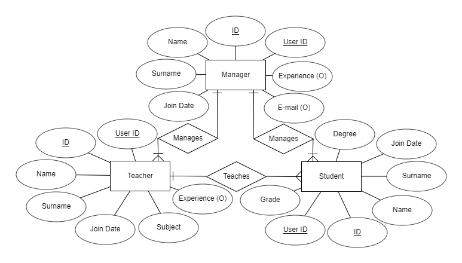

Parts Implemented by Burak Bozdağ
=================================

Database Design
---------------

I implemented three tables in this project: *Managers*, *Teachers* and *Students*.

Managers manages teachers and students. Teachers teaches students. Teachers gives lectures and etudes to students.
Students takes lectures and etudes from teachers. Managers also manages these lectures and etudes. The E/R diagram is
shown below:

    E/R diagram for managers, teachers and students.

Code
----

The implementation of tables in the database is done using the following code block:

.. code-block:: python
    :name: dbinit.py

    INIT_STATEMENTS = [
        """CREATE TABLE if not exists Managers ( id SERIAL PRIMARY KEY,
        name VARCHAR(255) NOT NULL,
        surname VARCHAR(255) NOT NULL,
        email VARCHAR(255),
        join_date DATE NOT NULL DEFAULT CURRENT_DATE,
        experience_year int,
        user_id int NOT NULL,
        FOREIGN KEY (user_id) REFERENCES Users(id));""",

        """CREATE TABLE if not exists Teachers ( id SERIAL PRIMARY KEY,
        name VARCHAR(255) NOT NULL,
        surname VARCHAR(255) NOT NULL,
        subject varchar(255),
        join_date DATE NOT NULL DEFAULT CURRENT_DATE,
        experience_year int,
        user_id int NOT NULL,
        FOREIGN KEY (user_id) REFERENCES Users(id));""",

        """CREATE TABLE if not exists Students ( id SERIAL PRIMARY KEY,
        name VARCHAR(255) NOT NULL,
        surname VARCHAR(255) NOT NULL,
        degree int NOT NULL,
        join_date DATE NOT NULL DEFAULT CURRENT_DATE,
        grade FLOAT,
        user_id int NOT NULL,
        FOREIGN KEY (user_id) REFERENCES Users(id));""",
    ]

There are many view functions such as login, home page, profile, etc. These functions are described in next parts.

Log In and Log Out
^^^^^^^^^^^^^^^^^^^

When signing in, the server checks whether the username exists in the database. Then, password checking is done using
hashing methods. If these requirements are satisfied, the user logs into the site successfully.

The following code block is responsible for logging in:

.. code-block:: python
    :name: server.py

    @app.route("/login", methods=['POST'])
    def login():
        username = request.form['UserName']
        user = get_user(username)
        if user is not None:
            password = request.form['Password']
            password1 = user.password
            if pbkdf2_sha256.verify(password, password1):
                login_user(user)
                flash("You have logged in.")
                return redirect("/")
        return render_template("signin.html", message="Invalid credentials.")

