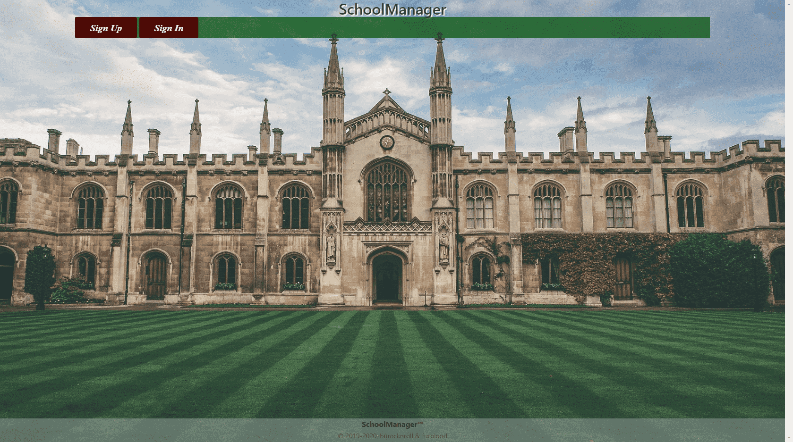
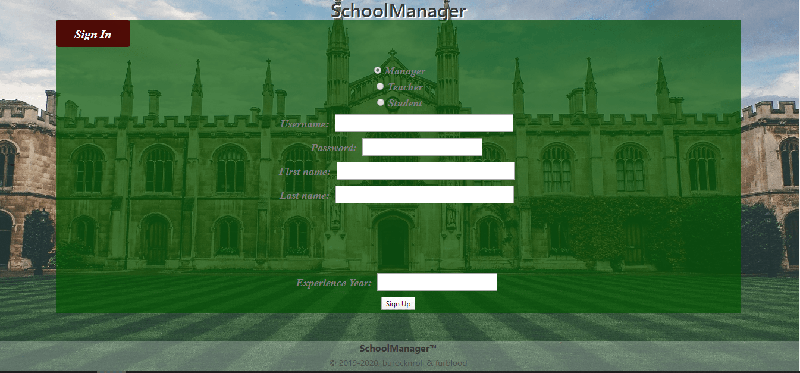
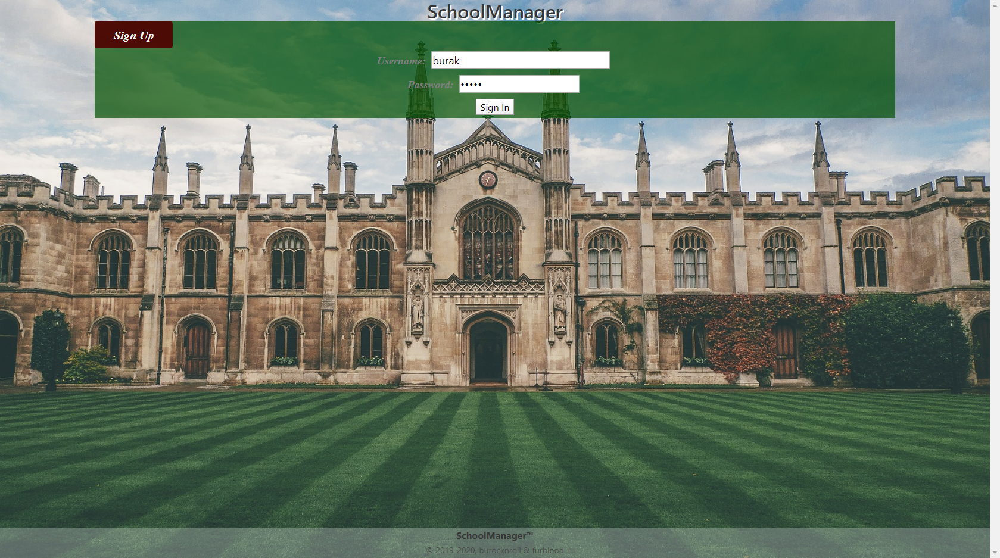
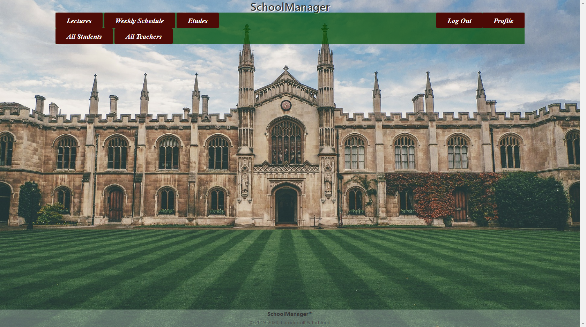
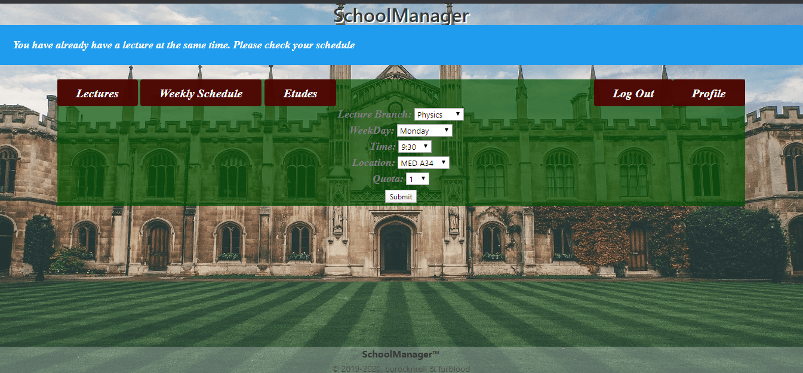
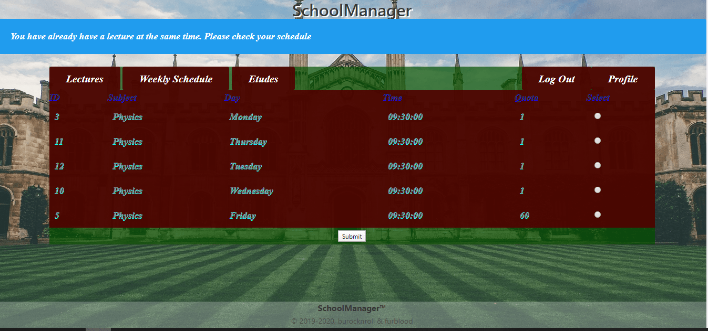
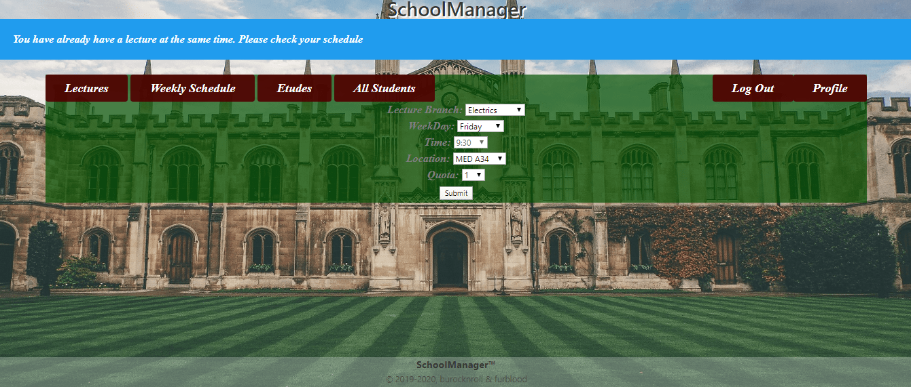
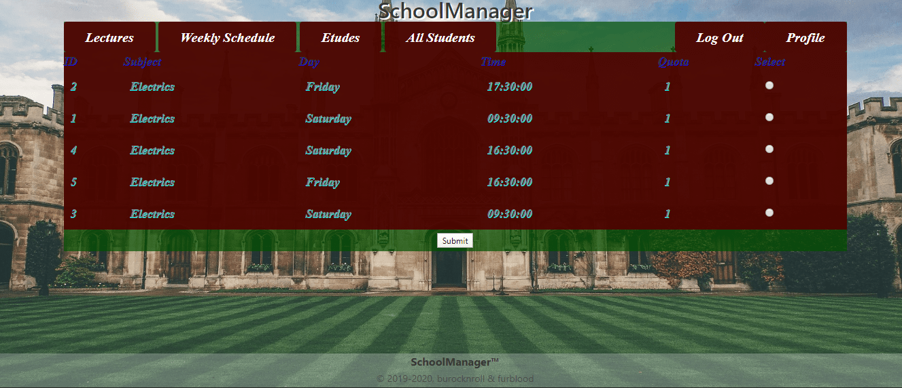
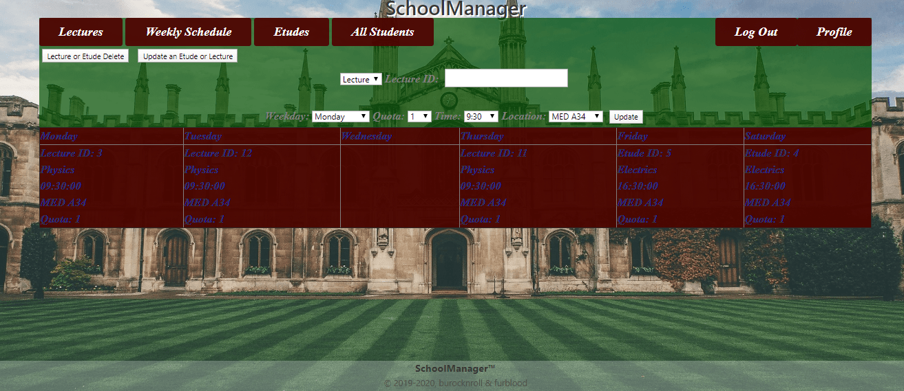
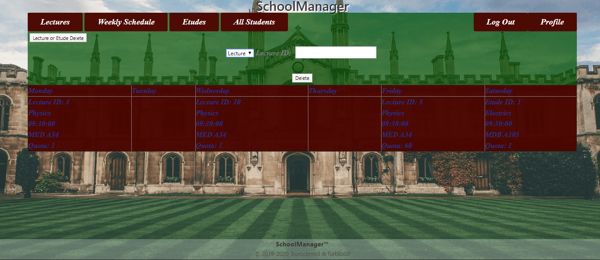

Parts Implemented by Muhammed Furkan Kamer
==========================================
New Users
---------

To use this site, you must sign up for our application. If you are not signed in or signed up yet, you will
probably see a page like this:

    The initial page for unsigned users. Sign up using the button and proceed to the next step.

Signing Up
----------

When you click the *Sign Up* button, a form will appear in your browser. First, you must select a radio button for
which account type do you want to sign up. Then a complete form will appear on screen according to your choice.
For example, in below a *Manager* signs up and in addition to common boxes like *username*, *password*, etc there is
an *experience year* box which must be filled. You cannot enter anything other than a number, if you did it will warn you to
enter a number. It can all be seen below:

    Enter necessary information to boxes.

Signing In
----------

When you click the *Sign In* button, a little form will appear in your browser. Type your username and password into
these boxes and click *Sign In*.

    Enter your username and password to log in.

After logging in, you should see the home page for signed users.

    Home page for signed users.
	
Lectures
--------

When you signed in successfully and see the homepage if you are a teacher or student you can route
to Lectures page for lecture registry or creation.

Teachers' Lectures Page
^^^^^^^^^^^^^^^^^^^^^^^

When logged in as a teacher, you can create a lecture from the lectures page using
select tags. You can select lecture name, time, day and building and quota for your new lecture.
After selections, you should click submit to create a lecture.
If any other lecture exists that overlaps, it redirects to the lectures page and warns you that 
there is another lecture that overlaps. Below we can see all these features.

    Teachers' Lectures Page

Students' Lectures Page
^^^^^^^^^^^^^^^^^^^^^^^

When logged in as a student, a list of lectures appears on the
screen. From that is every row has information about lectures and also a radio button
which is used to select a lecture to register. Only one lecture can be selected at the same time.
When you select a lecture, you should click the submit button. If no lecture of yours overlaps with these
it registers successfully. Else it will show a warning about overlap.

    Students' Lectures Page

Etudes
------

When you signed in successfully and see the homepage if you are a teacher or student you can also route
to Etudes page for etudes registry or creation.

Teachers' Etudes Page
^^^^^^^^^^^^^^^^^^^^^

When logged in as a teacher, you can create an etude from the etudes page using
select tags. You can select etude subject, time, day and building and quota for your new etude.
After selections, you should click submit to create an etude.
If any other etude exists that overlaps, it redirects to the etudes page and warns you that 
there is another etude that overlaps. Below we can see all these features.

    Teachers' Etudes Page

Students' Etudes Page
^^^^^^^^^^^^^^^^^^^^^

When logged in as a student, a list of etudes appears on the
screen. From that is every row has the information of etudes and also a radio button
which is used to select an etude to register. Only one etude can be selected at the same time.
When you select an etude, you should click the submit button. If no etude of yours overlaps with these
it registers successfully. Else it will show a warning about overlap.

    Students' Etudes Page
	
Schedule
--------

When you signed in successfully and see the homepage if you are a teacher or student you can also route
to schedule a page and see your weekly schedule.

Teachers' Schedule Page
^^^^^^^^^^^^^^^^^^^^^^^

When logged in as a teacher, you can see your weekly schedule on the schedule page.
Also, you can delete or update your lecture or etude in the schedule using an id that
is given in the schedule table. You can update every information of the lecture other from
id.

    Teachers' Schedule Page

Students' Schedule Page
^^^^^^^^^^^^^^^^^^^^^^^

When logged in as a student, you can see your weekly schedule on the schedule page.
Also, you can delete your registry from the lecture or etude in the schedule using an id that
is given in the schedule table. When you did it will be deleted from your schedule and number of enrolled students.

    Students' Schedule Page