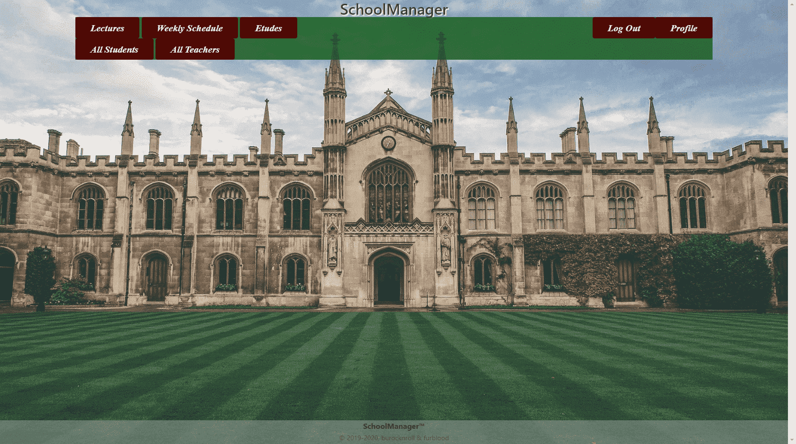

Parts Implemented by Muhammed Furkan Kamer
==========================================
New Users
---------

In order to use this site, you must sign up to our application. If you are not signed in or signed up yet, you will
probably see a page like this:

.. figure:: ../img/first.png
    :scale: 50 %
    :alt: map to buried treasure

    The initial page for unsigned users. Sign up using the button and proceed to the next step.

Signing Up
----------

When you click the *Sign Up* button, a form will appear in your browser. First you must select a radio button for
which account type do you want to sign up. Then a complete form will appear on screen according to your choice.
For example in below a *Manager* signs up and in addition to common boxes like *username*, *password*, etc there is
a *experience year* box which must be filled. You cannot enter anything other than number, if you did it will warns you to
enter a number. It can all be seen below:

.. figure:: ../img/fsignup.png
    :width: 100 %
    :alt: map to buried treasure

    Enter necessary information to boxes.

Signing In
----------

When you click the *Sign In* button, a little form will appear in your browser. Type your username and password into
these boxes and click *Sign In*.

.. figure:: ../img/login.png
    :width: 100 %
    :alt: map to buried treasure

    Enter your username and password to log in.

After logging in, you should see the home page for signed users.

    Home page for signed users.
	
Lectures
----------

When you signed in successfully and see homepage, if you are a teacher or student you can route
to Lectures page for lecture registry or creation, etudes for lecture registry or creation and schedule
page for update lectures, etudes or delete them from your schedule.

Teachers' Lectures Page
^^^^^^^^^^^^^^^

When logged in as teacher, you can create a lecture from lectures page using
select tags. You can select lecture name, time, day and building and quota for your new lecture.
After selections you should click submit to create language.
If any other lecture exists that overlaps, it redirects to lectures page and 
warns you about that there is another lecture that overlaps. Below we can see all these features.

    Teachers' Lectures Page

Students' Lectures Page
^^^^^^^^^^^^^^^

When logged in as student, a list of lectures appears on the
screen. From that is every row has the information of lectures and also a radio button
which is used to select a lecture to register. Only one lecture can be selected at the same time.
When you select a lecture, you should click submit button. If no lecture of yours overlaps with these
it registers successfully. Else it will show a warning about overlap.

    Students' Lectures Page
