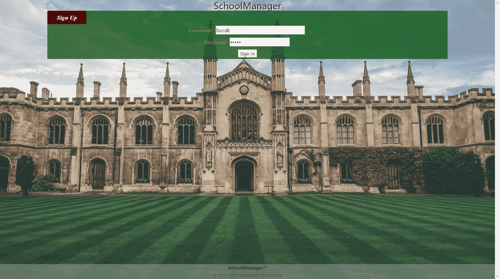
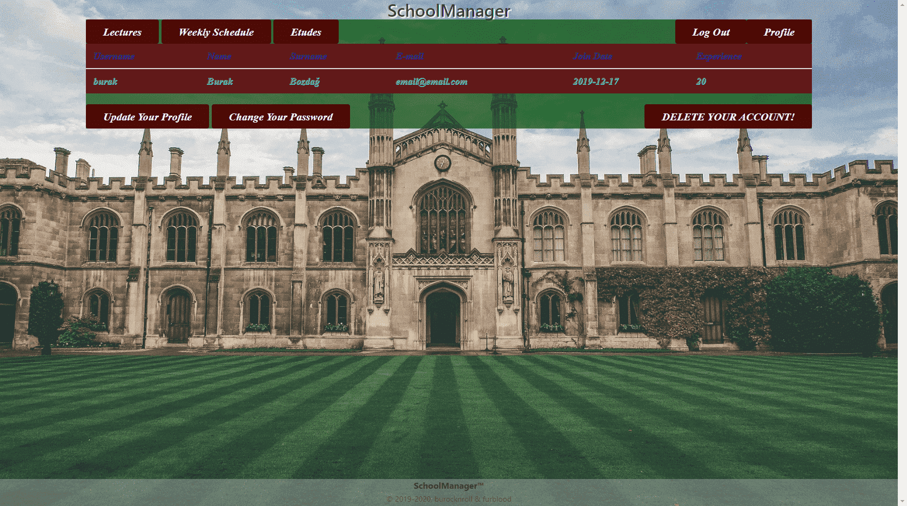
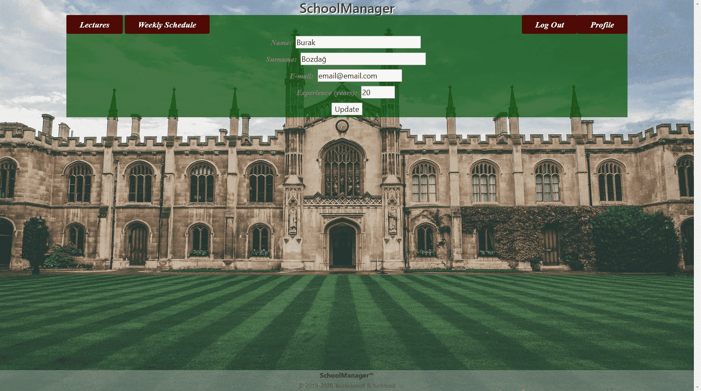
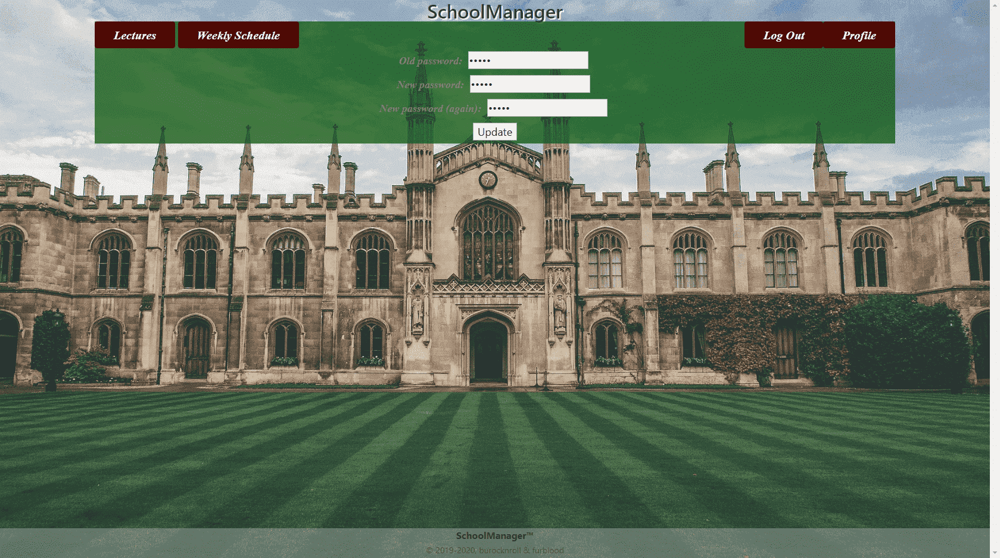
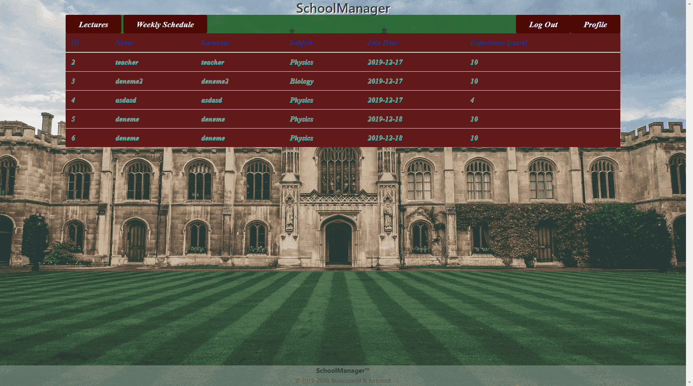
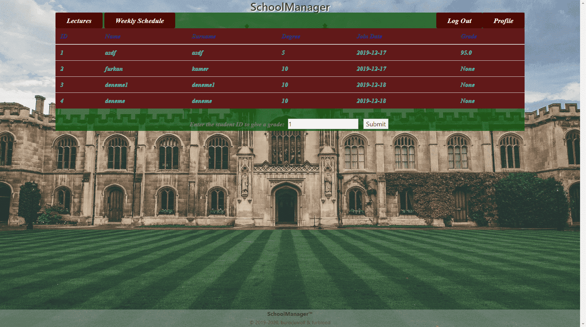
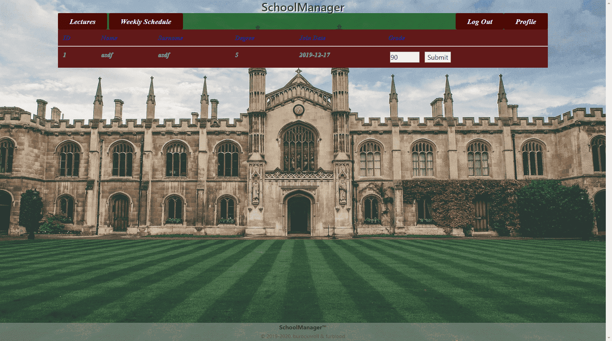

Parts Implemented by Burak Bozdağ
=================================

New Users
---------

In order to use this site, you must sign up to our application. If you are not signed in or signed up yet, you will
probably see a page like this:

.. figure:: ../img/first.png
    :width: 100 %
    :alt: map to buried treasure

    The initial page for unsigned users. Sign up using the button and proceed to the next step.

Signing In
----------

When you click the *Sign In* button, a little form will appear in your browser. Type your username and password into
these boxes and click *Sign In*.

    Enter your username and password to log in.

After logging in, you should see the home page for signed users.

.. figure:: ../img/homepage.png
    :width: 100 %
    :alt: map to buried treasure

    Home page for signed users.

Profile Actions
---------------
If you want to view your profile, you can click on the *Profile* button.

    The profile page.

Updating Profile
^^^^^^^^^^^^^^^^

In order to update your profile, you should click on the *Update Your Profile* button.

    The profile updating page.

Change attributes which you want and click on the *Update* button. You will be redirected to your profile page.

Updating Password
^^^^^^^^^^^^^^^^^

In order to update your password, you should click on the *Change Your Password* button.

    The page for password changes.

Enter your old password once and your new password twice. You will be logged out and redirected to the log in page for
security purposes.

Deleting Account
^^^^^^^^^^^^^^^^

In order to delete your account, you should click on the *DELETE YOUR ACCOUNT!* button. You will see a pop-up message
that confirms your action. After that, you will be logged out and redirected to the initial page.

Guides
------

Depending on your title, you can use various functions in the site. In next sections, the user guide will be divided
based on user titles.

Managers' Guide
^^^^^^^^^^^^^^^

As a manager, you have the biggest authorization in this application. You can view all teachers, students. You can also
grade students. These functions are explained in next sections.

Viewing All Teachers
""""""""""""""""""""

If you want to view all teachers in the database, you should click on the *All Teachers* button.

    All teachers in the database.

Viewing All Students
""""""""""""""""""""

If you want to view all students in the database, you should click on the *All Students* button.

    All students in the database.

Grading Students
""""""""""""""""

You can grade students using the previous page. You should write the student's ID into the box below, then click
*Submit*. After that, you will see the profile of the student.

    The grading page.

After entering a grade, click *Submit* and you will be redirected to the students page.

Teachers' Guide
^^^^^^^^^^^^^^^

As a teacher, you are responsible for giving lectures and etudes to your students. You can also grade students. I
implemented the grading part, so in this page, you will see only the grading guide.

Viewing All Students
""""""""""""""""""""

If you want to view all students in the database, you should click on the *All Students* button.

    All students in the database.

Grading Students
""""""""""""""""

You can grade students using the previous page. You should write the student's ID into the box below, then click
*Submit*. After that, you will see the profile of the student.

    The grading page.

After entering a grade, click *Submit* and you will be redirected to the students page.

Students' Guide
^^^^^^^^^^^^^^^

As a student, you are responsible for taking lectures and etudes. You can also view your weekly schedule. I did not
implemented lectures and etudes, so this guide is written in my partner's section.
